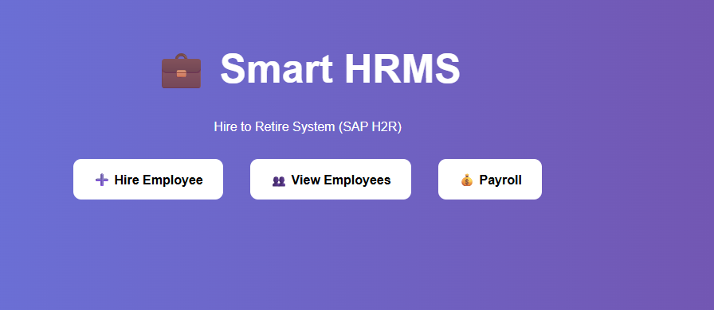
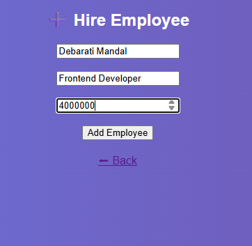
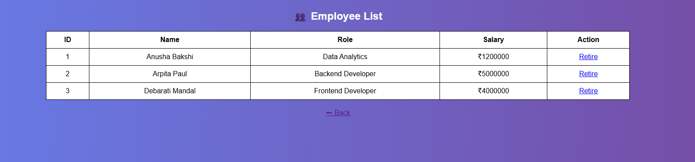

# 💼 Smart HRMS - Hire to Retire System

## 📌 Overview
A web-based HR Management System simulating SAP H2R lifecycle.

## 🚀 Features
- Employee Hiring
- Employee Management
- Payroll System
- Retirement Process

## 🛠 Tech Stack
- Python (Flask)
- HTML, CSS
- SQLite

## ▶️ Run Project
cd backend  
python init_db.py  
python app.py  

Open: http://127.0.0.1:5000/

## 📸 Screenshots

### 🏠 Home Page

### ➕ Add Employee

### 👥 Employee List

### 💰 Payroll

## 👩‍💻 Author
Anusha Bakshi
🎓 Student | 💻 Developer  